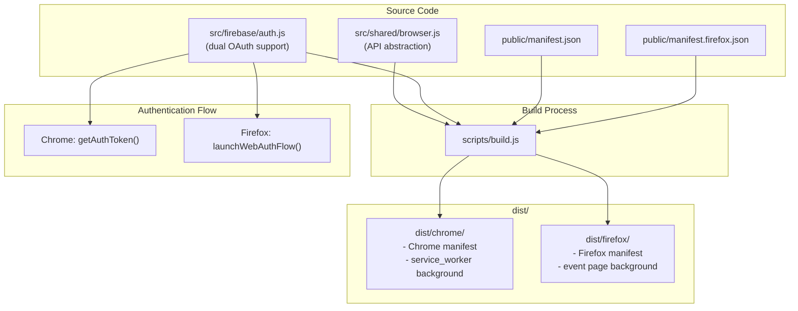

# Firefox Extension Port Plan

## Decisions Made

- **Minimum Firefox version**: 128+ (required for `world: "MAIN"` support)
- **OAuth approach**: Google OAuth via `launchWebAuthFlow()`
- **Build strategy**: Separate manifests (`manifest.json` for Chrome, `manifest.firefox.json` for Firefox)
- **Testing**: Add Firefox e2e tests to CI

---

## Overview

This plan covers porting the Sticky Notes Chrome extension to Firefox. The extension uses Chrome Manifest V3, which has significant differences from Firefox's MV3 implementation. The main challenges are:

1. **Background Script Architecture**: Firefox uses event pages, not service workers
2. **Authentication API**: Firefox lacks `chrome.identity.getAuthToken()` - requires `launchWebAuthFlow()`
3. **API Namespace**: Firefox uses `browser.*` instead of `chrome.*`
4. **Manifest Differences**: Separate Firefox manifest without Chrome-specific fields

---

## Architecture Overview



---

## Implementation Tasks

- [ ] Create `src/shared/browser.js` with unified browser API abstraction using `globalThis.browser || globalThis.chrome` pattern
- [ ] Create `public/manifest.firefox.json` with gecko settings, event page background, and no Chrome-specific fields
- [ ] Implement Firefox OAuth using `launchWebAuthFlow()` in `src/firebase/auth.js` with browser detection and token parsing
- [ ] Document Google Cloud Console setup for Firefox redirect URI (`browser.identity.getRedirectURL()`)
- [ ] Update all 9 files using `chrome.*` APIs to use the browser abstraction layer
- [ ] Update `scripts/build.js` to generate `dist/firefox/` with Firefox manifest and create `firefox.zip`
- [ ] Add `web-ext` dev dependency and npm scripts for local Firefox testing
- [ ] Add Firefox to `playwright.config.js` and create `.github/workflows/ci-firefox.yml`
- [ ] Update unit tests for browser abstraction and Firefox auth flow

---

## Implementation Details

### Phase 1: Browser API Abstraction

**New file: `src/shared/browser.js`**

```javascript
/**
 * Cross-browser API abstraction
 * Provides unified access to browser extension APIs
 */

// Use browser namespace if available (Firefox), fallback to chrome (Chrome)
export const browserAPI = globalThis.browser || globalThis.chrome;

// Helper to detect Firefox
export const isFirefox = typeof globalThis.browser !== 'undefined';

// Helper to detect Chrome  
export const isChrome = !isFirefox && typeof globalThis.chrome !== 'undefined';

// Export individual APIs for convenience
export const runtime = browserAPI?.runtime;
export const storage = browserAPI?.storage;
export const tabs = browserAPI?.tabs;
export const identity = browserAPI?.identity;
export const action = browserAPI?.action;
export const contextMenus = browserAPI?.contextMenus;
export const webNavigation = browserAPI?.webNavigation;
export const scripting = browserAPI?.scripting;
export const i18n = browserAPI?.i18n;
```

**Files to update** (replace `chrome.*` with imports from `browser.js`):

- `src/background/index.js`
- `src/background/handlers.js`
- `src/firebase/auth.js`
- `src/popup/popup.js`
- `src/popup/handlers.js`
- `src/content/app/StickyNotesApp.js`
- `src/content/app/MessageHandler.js`
- `src/content/components/StickyNote.js`
- `src/shared/i18n.js`

---

### Phase 2: Firefox Manifest

**New file: `public/manifest.firefox.json`**

Key differences from Chrome manifest:

```json
{
  "manifest_version": 3,
  "name": "__MSG_extName__",
  "version": "1.2.0",
  "description": "__MSG_extDescription__",
  "default_locale": "en",
  
  "browser_specific_settings": {
    "gecko": {
      "id": "sticky-notes@example.com",
      "strict_min_version": "128.0"
    }
  },
  
  "permissions": [
    "activeTab",
    "tabs",
    "storage",
    "scripting",
    "webNavigation",
    "identity",
    "contextMenus"
  ],
  
  "host_permissions": ["<all_urls>"],
  
  "background": {
    "scripts": ["src/background/background.js"]
  },
  
  "content_scripts": [
    {
      "matches": ["<all_urls>"],
      "js": ["src/content/pageContext.js"],
      "run_at": "document_start",
      "all_frames": true,
      "world": "MAIN"
    },
    {
      "matches": ["<all_urls>"],
      "js": ["src/content/content.js"],
      "run_at": "document_idle",
      "all_frames": true
    }
  ]
}
```

**Removed from Firefox manifest:**

- `key` field (Chrome extension key)
- `oauth2` block (Chrome-only feature)
- `service_worker` in background (replaced with `scripts`)
- `type: "module"` in background (Firefox event pages don't support ES modules directly)

---

### Phase 3: Authentication Rewrite

**Update `src/firebase/auth.js`** to support both browsers:

```javascript
import { isFirefox, identity, runtime } from '../shared/browser.js';

/**
 * Get OAuth token - browser-specific implementation
 */
export async function getOAuthToken(deps = {}) {
  if (isFirefox) {
    return getOAuthTokenFirefox(deps);
  }
  return getOAuthTokenChrome(deps);
}

/**
 * Chrome: Use chrome.identity.getAuthToken()
 */
async function getOAuthTokenChrome(deps = {}) {
  const chromeIdentity = deps.chromeIdentity || chrome.identity;
  const chromeRuntime = deps.chromeRuntime || chrome.runtime;
  
  return new Promise((resolve, reject) => {
    chromeIdentity.getAuthToken({ interactive: true }, (token) => {
      if (chromeRuntime.lastError) {
        reject(new Error(chromeRuntime.lastError.message));
        return;
      }
      resolve(token);
    });
  });
}

/**
 * Firefox: Use browser.identity.launchWebAuthFlow()
 */
async function getOAuthTokenFirefox(deps = {}) {
  const browserIdentity = deps.browserIdentity || browser.identity;
  const clientId = getOAuthClientId();
  
  // Get the redirect URL for this extension
  const redirectUrl = browserIdentity.getRedirectURL();
  
  // Build Google OAuth URL
  const authUrl = new URL('https://accounts.google.com/o/oauth2/v2/auth');
  authUrl.searchParams.set('client_id', clientId);
  authUrl.searchParams.set('redirect_uri', redirectUrl);
  authUrl.searchParams.set('response_type', 'token');
  authUrl.searchParams.set('scope', [
    'https://www.googleapis.com/auth/userinfo.email',
    'https://www.googleapis.com/auth/userinfo.profile'
  ].join(' '));
  
  // Launch the auth flow
  const responseUrl = await browserIdentity.launchWebAuthFlow({
    url: authUrl.toString(),
    interactive: true
  });
  
  // Parse the access token from the redirect URL
  const url = new URL(responseUrl);
  const hash = url.hash.substring(1); // Remove leading #
  const params = new URLSearchParams(hash);
  const accessToken = params.get('access_token');
  
  if (!accessToken) {
    throw new Error('No access token in OAuth response');
  }
  
  return accessToken;
}
```

**Google Cloud Console Setup Required:**

1. Go to Google Cloud Console > APIs & Services > Credentials
2. Edit the existing OAuth 2.0 Client ID (or create new one for Firefox)
3. Add authorized redirect URI: The Firefox extension redirect URL
   - Format: `https://<extension-id>.extensions.allizom.org/` (for AMO)
   - Or use `browser.identity.getRedirectURL()` output during development

---

### Phase 4: Build System Updates

**Update `scripts/build.js`** to support Firefox:

```javascript
// Add Firefox build target
const BROWSERS = ['chrome', 'firefox'];

// Browser-specific manifest handling
function getManifestForBrowser(browser) {
  const manifestFile = browser === 'firefox' 
    ? 'manifest.firefox.json' 
    : 'manifest.json';
  return JSON.parse(readFileSync(resolve(publicDir, manifestFile), 'utf-8'));
}

// Background script format differs
async function buildBackground(browser) {
  const format = browser === 'firefox' ? 'iife' : 'es';
  // ... rest of build config
}
```

**New npm scripts in `package.json`:**

```json
{
  "scripts": {
    "build": "node scripts/build.js",
    "build:chrome": "node scripts/build.js --browser=chrome",
    "build:firefox": "node scripts/build.js --browser=firefox",
    "build:all": "node scripts/build.js --browser=all",
    "dev:firefox": "web-ext run --source-dir dist/firefox"
  }
}
```

---

### Phase 5: Testing Setup

**Add dev dependency:**

```bash
npm install --save-dev web-ext
```

**Update `playwright.config.js`:**

```javascript
export default defineConfig({
  projects: [
    {
      name: 'chromium',
      use: { ...devices['Desktop Chrome'] },
    },
    {
      name: 'firefox',
      use: { ...devices['Desktop Firefox'] },
    },
  ],
});
```

**New CI workflow: `.github/workflows/ci-firefox.yml`:**

```yaml
name: Firefox E2E Tests

on:
  push:
    branches: [main]
  pull_request:
    branches: [main]

jobs:
  test-firefox:
    runs-on: ubuntu-latest
    steps:
      - uses: actions/checkout@v4
      - uses: actions/setup-node@v4
        with:
          node-version: '20'
      - run: npm ci
      - run: npm run build:firefox
      - run: npx playwright install firefox
      - run: npm run test:e2e -- --project=firefox
```

---

## Files Summary

**New Files:**

- `src/shared/browser.js` - Browser API abstraction
- `public/manifest.firefox.json` - Firefox-specific manifest
- `.github/workflows/ci-firefox.yml` - Firefox CI workflow

**Modified Files:**

- `src/firebase/auth.js` - Add Firefox OAuth via launchWebAuthFlow()
- `src/background/index.js` - Use browser abstraction
- `src/background/handlers.js` - Use browser abstraction
- `src/popup/popup.js` - Use browser abstraction
- `src/popup/handlers.js` - Use browser abstraction
- `src/content/app/StickyNotesApp.js` - Use browser abstraction
- `src/content/app/MessageHandler.js` - Use browser abstraction
- `src/content/components/StickyNote.js` - Use browser abstraction
- `src/shared/i18n.js` - Use browser abstraction
- `scripts/build.js` - Add Firefox build target
- `package.json` - Add web-ext and new scripts
- `playwright.config.js` - Add Firefox project
- Unit tests for affected files

---

## Complexity Estimates

| Task | Complexity | Notes |
|------|------------|-------|
| Browser API abstraction | Low | Pattern replacement |
| Firefox manifest | Low | Straightforward |
| OAuth rewrite | High | Different flow, token parsing |
| Google Cloud setup | Low | Documentation |
| Build system | Medium | New target, IIFE vs ES module |
| Testing setup | Medium | New browser, CI config |
